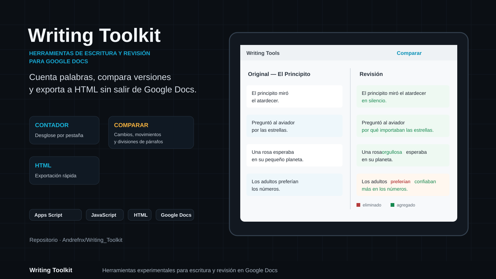
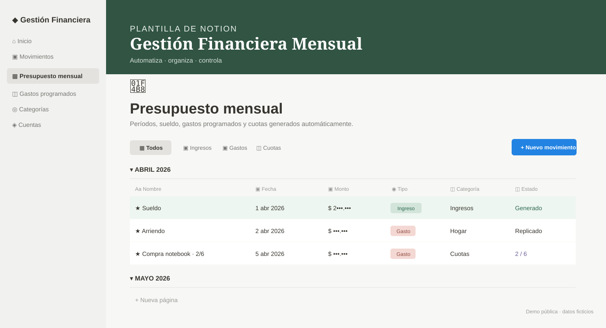

## TECNOLOGÍAS
<table width="100%">
<tr>
<th width="25%">LENGUAJES</th><th width="25%">FRONTEND</th><th width="25%">BACKEND</th><th width="25%">BASE DE DATOS</th>
</tr>
<tr>
<td align="center"> <b>Python</b></td>
<td align="center"> <b>HTML5</b></td>
<td align="center"> <b>Django</b></td>
<td align="center"> <b>PostgreSQL</b></td>
</tr>
<tr>
<td align="center"> <b>JavaScript</b></td>
<td align="center"> <b>CSS3</b></td>
<td align="center"> <b>Node.js</b></td>
<td align="center"> <b>MySQL</b></td>
</tr>
<tr>
<td align="center"> <b>Java</b></td>
<td align="center"> <b>Bootstrap</b></td>
<td align="center"> <b>React</b></td>
<td></td>
</tr>
<tr><td></td><td></td><td align="center"> <b>Postman</b></td><td></td></tr>
</table>

## PROYECTOS DESTACADOS

<table width="100%"><tr>
<td width="50%" align="center" valign="top">
<h3>01. VetSantaSofia</h3>

Sistema web de gestión veterinaria para centralizar el trabajo diario de una clínica. Incluye agenda por veterinario, gestión de pacientes, fichas e historial clínico, consultas, hospitalizaciones y seguimiento del estado de atención. Cuenta además con una demo pública interactiva para recorrer el flujo principal del sistema.

<code>Python</code> <code>Django</code> <code>PostgreSQL</code> <code>JavaScript</code> <code>Bootstrap</code>

&nbsp;&nbsp;

</td>
<td width="50%" align="center" valign="top">
<h3>02. Writing Toolkit</h3>

Conjunto de herramientas para Google Docs desarrollado con Apps Script para apoyar la escritura y revisión de documentos. Permite contar palabras con desglose por pestaña, comparar versiones detectando contenido nuevo, eliminado, modificado, movido o dividido, y exportar la pestaña activa a HTML.

<code>Google Apps Script</code> <code>JavaScript</code> <code>HTML</code> <code>Google Docs</code>

</td>
</tr></table>

<table width="100%"><tr>
<td width="50%" align="center" valign="top">
<h3>03. Notion Automatizaciones</h3>

Plantilla visual de gestión financiera mensual inspirada en Notion y conectada a una automatización real con Python y requests. Prepara cada período, registra ingresos programados, replica gastos recurrentes y genera cuotas, con una demo pública que utiliza únicamente datos ficticios y credenciales totalmente separadas.

<code>Python</code> <code>Requests</code> <code>Notion API</code> <code>React</code> <code>JavaScript</code>

&nbsp;&nbsp;

</td>
<td width="50%"></td>
</tr></table>
