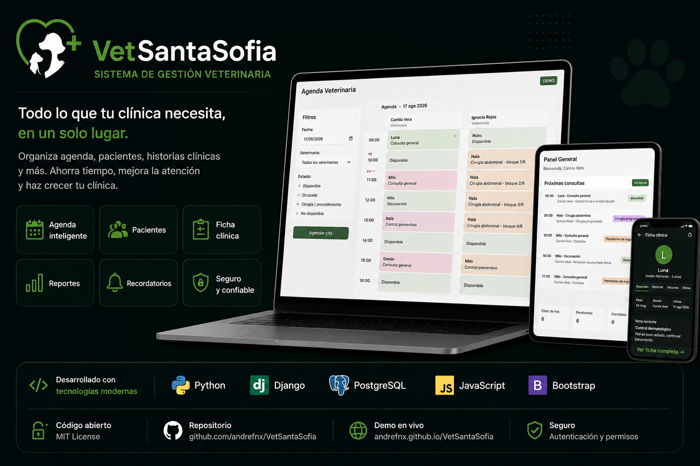
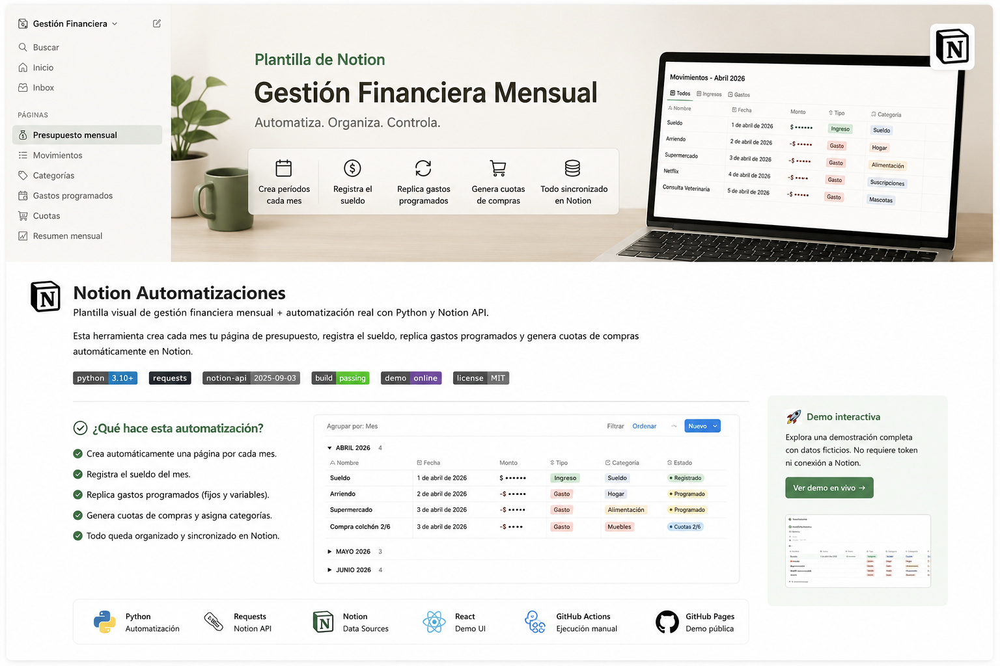
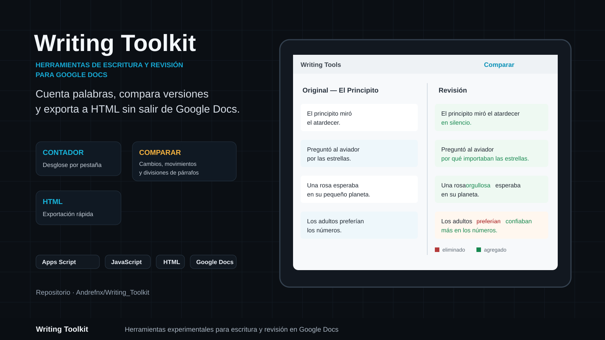
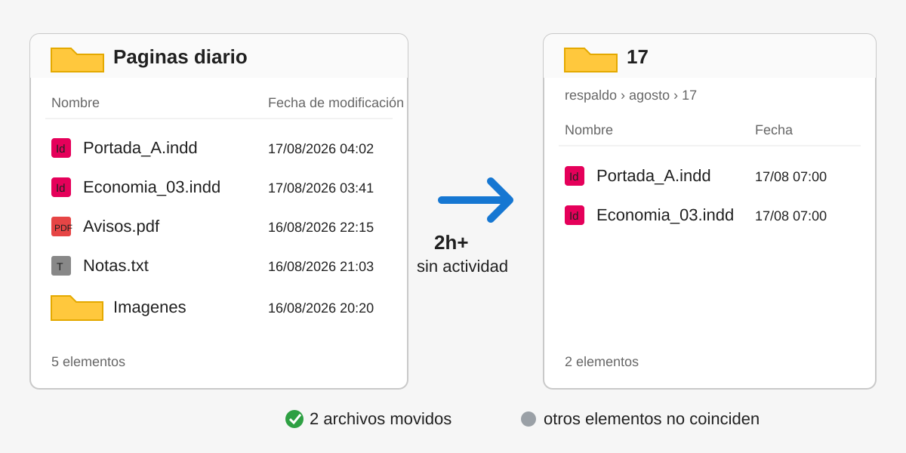

## TECNOLOGÍAS
<table width="100%">
<tr>
<td width="16.66%" height="135" align="center" valign="middle"> <b>Python</b> </td>
<td width="16.66%" height="135" align="center" valign="middle"> <b>JavaScript</b> </td>
<td width="16.66%" height="135" align="center" valign="middle"> <b>Java</b> </td>
<td width="16.66%" height="135" align="center" valign="middle"> <b>HTML5</b> </td>
<td width="16.66%" height="135" align="center" valign="middle"> <b>CSS3</b> </td>
<td width="16.66%" height="135" align="center" valign="middle"> <b>Bootstrap</b> </td>
</tr>
<tr>
<td width="16.66%" height="135" align="center" valign="middle"> <b>React</b> </td>
<td width="16.66%" height="135" align="center" valign="middle"> <b>Django</b> </td>
<td width="16.66%" height="135" align="center" valign="middle"> <b>Node.js</b> </td>
<td width="16.66%" height="135" align="center" valign="middle"> <b>PostgreSQL</b> </td>
<td width="16.66%" height="135" align="center" valign="middle"> <b>MySQL</b> </td>
<td width="16.66%" height="135" align="center" valign="middle">&nbsp;</td>
</tr>
</table>

## Proyectos destacados

<table width="100%">
<tr>
<td width="50%" align="center" valign="top">
<h3>01. VetSantaSofia</h3>

Sistema de gestión veterinaria desarrollado desde cero como proyecto de título aprobado. Integra agenda, pacientes, atención clínica, hospitalización, inventario, servicios, caja y administración según roles.

<code>Python</code> <code>Django</code> <code>PostgreSQL</code> <code>JavaScript</code> <code>Bootstrap</code>

</td>
<td width="50%" align="center" valign="top">
<h3>02. Notion Automatizaciones</h3>

Automatizaciones en Python para consultar, procesar y actualizar información de Notion mediante su API, reduciendo tareas manuales recurrentes.

<code>Python</code> <code>Requests</code> <code>Notion API</code> <code>JavaScript</code>

</td>
</tr>
<tr>
<td width="50%" align="center" valign="top">
<h3>03. Writing Toolkit</h3>

Herramienta para Google Docs orientada a organizar, comparar y revisar textos durante el proceso de escritura. Actualmente continúa en desarrollo.

<code>Google Apps Script</code> <code>JavaScript</code> <code>HTML</code> <code>Google Docs</code>

</td>
<td width="50%" align="center" valign="top">
<h3>04. Organizador-Respaldos-Windows</h3>

Automatización en Python para organizar y respaldar archivos de producción en Windows mediante reglas de fecha, jornada e inactividad, con ejecución programada y prevención de sobrescrituras.

<code>Python</code> <code>pytest</code> <code>PowerShell</code> <code>Windows Task Scheduler</code>

</td>
</tr>
</table>
