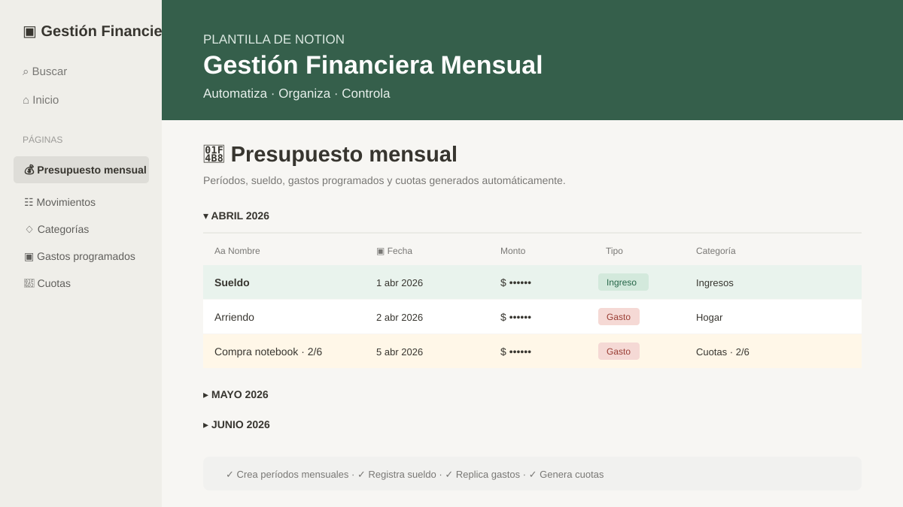

## TECNOLOGÍAS
<table width="100%">
<tr>
<th width="25%">LENGUAJES</th>
<th width="25%">FRONTEND</th>
<th width="25%">BACKEND</th>
<th width="25%">BASE DE DATOS</th>
</tr>
<tr>
<td align="center" valign="middle">
   
  <b>Python</b> 
  
</td>
<td align="center" valign="middle">
   
  <b>HTML5</b> 
  
</td>
<td align="center" valign="middle">
   
  <b>Django</b> 
  
</td>
<td align="center" valign="middle">
   
  <b>PostgreSQL</b> 
  
</td>
</tr>
<tr>
<td align="center" valign="middle">
   
  <b>JavaScript</b> 
  
</td>
<td align="center" valign="middle">
   
  <b>CSS3</b> 
  
</td>
<td align="center" valign="middle">
   
  <b>Node.js</b> 
  
</td>
<td align="center" valign="middle">
   
  <b>MySQL</b> 
  
</td>
</tr>
<tr>
<td align="center" valign="middle">
   
  <b>Java</b> 
  
</td>
<td align="center" valign="middle">
   
  <b>Bootstrap</b> 
  
</td>
<td align="center" valign="middle">
   
  <b>React</b> 
  
</td>
<td></td>
</tr>
</table>

## PROYECTOS DESTACADOS

<table width="100%"><tr>
<td width="50%" align="center" valign="top">
<h3>01. VetSantaSofia</h3>

Sistema web de gestión veterinaria para centralizar el trabajo diario de una clínica. Incluye agenda inteligente por veterinario, pacientes, ficha e historial clínico, consultas, hospitalizaciones, reportes y recordatorios. La demo pública permite recorrer el flujo principal del sistema con una presentación visual orientada a escritorio, tablet y móvil.

<code>Python</code> <code>Django</code> <code>PostgreSQL</code> <code>JavaScript</code> <code>Bootstrap</code>

&nbsp;&nbsp;

</td>
<td width="50%" align="center" valign="top">
<h3>02. Writing Toolkit</h3>

Conjunto de herramientas para Google Docs desarrollado con Apps Script para apoyar la escritura y revisión de documentos. Permite contar palabras con desglose por pestaña, comparar versiones detectando contenido nuevo, eliminado, modificado, movido o dividido, y exportar la pestaña activa a HTML.

<code>Google Apps Script</code> <code>JavaScript</code> <code>HTML</code> <code>Google Docs</code>

</td>
</tr></table>

<table width="100%"><tr>
<td width="50%" align="center" valign="top">
<h3>03. Notion Automatizaciones</h3>

Plantilla de gestión financiera mensual con estética de Notion y automatización real mediante Python, requests y Notion API. Crea períodos mensuales, registra el sueldo, replica gastos programados y genera cuotas de compras; la demo pública usa exclusivamente datos ficticios y no requiere token ni conexión a una cuenta de Notion.

<code>Python</code> <code>Requests</code> <code>Notion API</code> <code>React</code> <code>JavaScript</code>

&nbsp;&nbsp;

</td>
<td width="50%"></td>
</tr></table>
