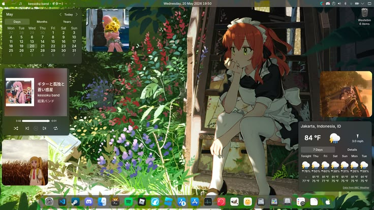
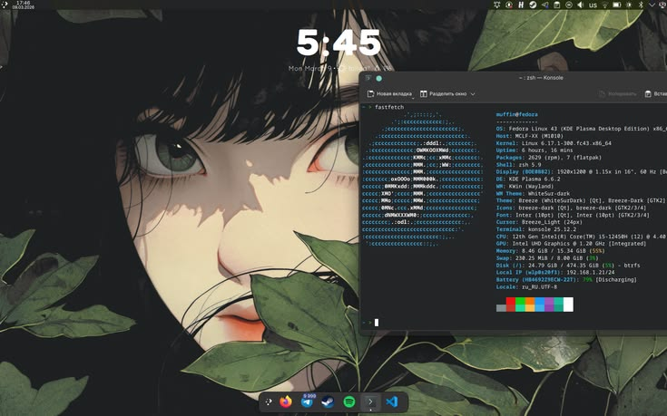

# Andrea Henríquez

Fullstack Back End & APIs Diseño Web

## LENGUAJES Y TECNOLOGÍAS
<table width="100%">
<tr>
<th width="25%">LENGUAJES</th>
<th width="25%">FRONTEND</th>
<th width="25%">BACKEND</th>
<th width="25%">BASE DE DATOS</th>
</tr>
<tr>
<td align="center" valign="middle">
   
  <b>Python</b> 
  
</td>
<td align="center" valign="middle">
   
  <b>HTML5</b> 
  
</td>
<td align="center" valign="middle">
   
  <b>Django</b> 
  
</td>
<td align="center" valign="middle">
   
  <b>PostgreSQL</b> 
  
</td>
</tr>
<tr>
<td align="center" valign="middle">
   
  <b>JavaScript</b> 
  
</td>
<td align="center" valign="middle">
   
  <b>CSS3</b> 
  
</td>
<td align="center" valign="middle">
   
  <b>Node.js</b> 
  
</td>
<td align="center" valign="middle">
   
  <b>MySQL</b> 
  
</td>
</tr>
<tr>
<td align="center" valign="middle">
   
  <b>Java</b> 
  
</td>
<td align="center" valign="middle">
   
  <b>Bootstrap</b> 
  
</td>
<td align="center" valign="middle">
   
  <b>React</b> 
  
</td>
<td></td>
</tr>
<tr>
<td></td>
<td></td>
<td align="center" valign="middle">
   
  <b>Postman</b> 
  
</td>
<td></td>
</tr>
</table>

<!-- SECCIÓN PROYECTOS DESTACADOS -->
## PROYECTOS DESTACADOS

<table width="100%" border="0" cellspacing="0" cellpadding="0">
  <tr>
    <!-- PROYECTO 1 -->
    <td width="50%" valign="top" style="padding-right: 6px;">
      

        
        <h3 align="left" style="margin: 0 0 6px 0; color: #f0f6fc; font-size: 15px; font-weight: 700; border-bottom: none;">
          Proyecto 1
        </h3>
        

          Descripción breve del proyecto enfocado en la solución desarrollada, integración de arquitectura backend y usabilidad.
        

        

          Python
          Django
        

        

          <a href="TU_LINK_AQUI" style="text-decoration: none; color: #58a6ff; font-size: 11px; font-weight: 600;">
            Ver repositorio →
          </a>
        

      

    </td>
    <!-- PROYECTO 2 -->
    <td width="50%" valign="top" style="padding-left: 6px;">
      

        
        <h3 align="left" style="margin: 0 0 6px 0; color: #f0f6fc; font-size: 15px; font-weight: 700; border-bottom: none;">
          Proyecto 2
        </h3>
        

          Descripción breve del proyecto enfocada en funcionalidades clave, optimización e interacción con el cliente/API.
        

        

          JavaScript
          REST API
        

        

          <a href="TU_LINK_AQUI" style="text-decoration: none; color: #58a6ff; font-size: 11px; font-weight: 600;">
            Ver repositorio →
          </a>
        

      

    </td>
  </tr>
</table>
