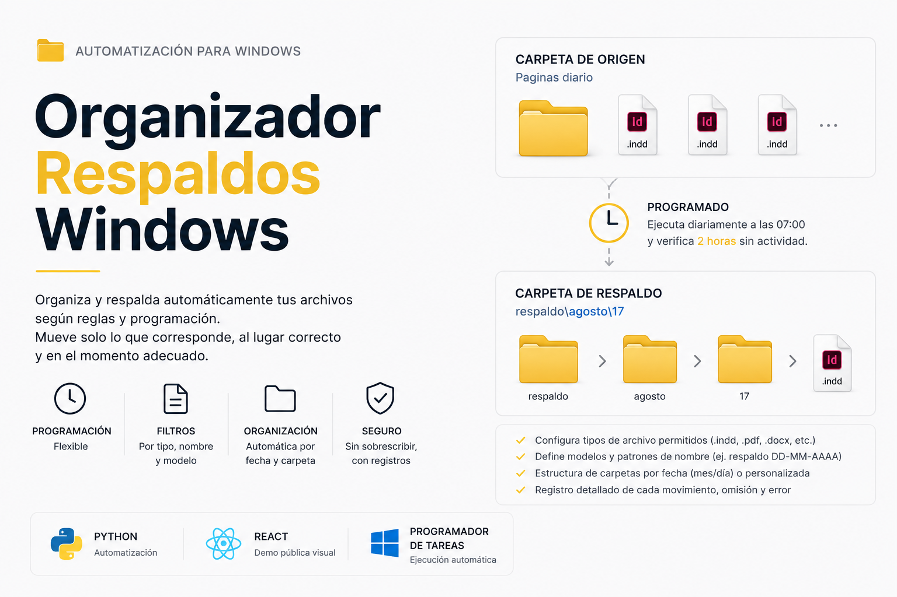

## TECNOLOGÍAS
<table width="100%">
<tr>
<th width="25%">LENGUAJES</th>
<th width="25%">FRONTEND</th>
<th width="25%">BACKEND</th>
<th width="25%">BASE DE DATOS</th>
</tr>
<tr>
<td align="center" valign="middle">
   
  <b>Python</b> 
  
</td>
<td align="center" valign="middle">
   
  <b>HTML5</b> 
  
</td>
<td align="center" valign="middle">
   
  <b>Django</b> 
  
</td>
<td align="center" valign="middle">
   
  <b>PostgreSQL</b> 
  
</td>
</tr>
<tr>
<td align="center" valign="middle">
   
  <b>JavaScript</b> 
  
</td>
<td align="center" valign="middle">
   
  <b>CSS3</b> 
  
</td>
<td align="center" valign="middle">
   
  <b>Node.js</b> 
  
</td>
<td align="center" valign="middle">
   
  <b>MySQL</b> 
  
</td>
</tr>
<tr>
<td align="center" valign="middle">
   
  <b>Java</b> 
  
</td>
<td align="center" valign="middle">
   
  <b>Bootstrap</b> 
  
</td>
<td align="center" valign="middle">
   
  <b>React</b> 
  
</td>
<td></td>
</tr>
</table>

## Proyectos destacados

### 01. VetSantaSofia

Sistema de gestión veterinaria que integra agenda, pacientes, atención clínica, hospitalización, inventario, servicios, caja y administración según los roles del equipo.

**Tecnologías:** `Python` · `Django` · `PostgreSQL` · `JavaScript` · `Bootstrap`

**Repositorio:** https://github.com/Andrefnx/VetSantaSofia  
**Demo:** https://andrefnx.github.io/VetSantaSofia/

---

### 02. Notion Automatizaciones

Conjunto de automatizaciones en Python para consultar, procesar y actualizar información de Notion mediante su API y ejecuciones programadas.

**Tecnologías:** `Python` · `Requests` · `Notion API` · `React` · `JavaScript`

**Repositorio:** https://github.com/Andrefnx/Notion_Automatizaciones  
**Demo:** https://andrefnx.github.io/Notion_Automatizaciones/

---

### 03. Writing Toolkit

Herramienta complementaria para Google Docs orientada a organizar, comparar y revisar textos durante el proceso de escritura. Actualmente continúa en desarrollo.

**Tecnologías:** `Google Apps Script` · `JavaScript` · `HTML` · `Google Docs`

**Repositorio:** https://github.com/Andrefnx/Writing_Toolkit

---

### 04. Organizador de Windows

Herramienta configurable para clasificar y mover automáticamente archivos o carpetas según nombres, tipos, fechas y reglas programadas por el usuario.

**Tecnologías:** `Python` · `React` · `Windows Task Scheduler`

**Repositorio:** https://github.com/Andrefnx/Project_Manager
